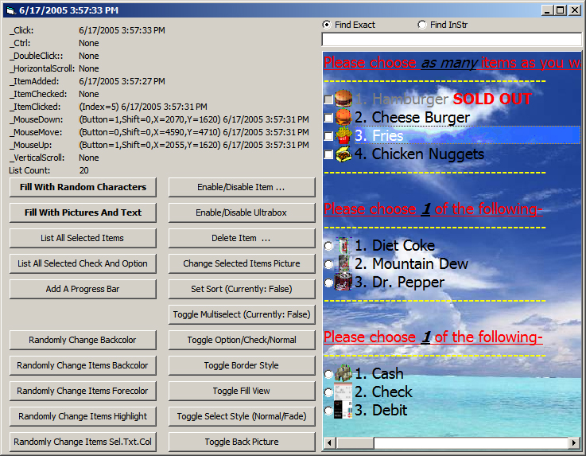



## Ultrabox \- Listbox Replacement Control \(Tons of Features\!\)

### Description

A nicely format text file of this description is in the zip file.

Seems PSC is working again. This will most likely be the final upload of this, unless there is any major problems.

Ultrabox Features:

*A picture can be added to the begining of each item, with optional transparency.

*Bold, Italic, Underline can be added to the items, with the ability to have only part of the string any of those three (or a combo of them)

*Can Enable/Disable the whole listbox

*Can Enable/Disable only 1 item

*Has a Sorted property to sort the list in ABC order

*MultiSelect, ability to select more then 1 item, while holding down the CTRL or Shift button.

*Multicolored items

*Check/Option items

*Horizontal Scrollbar

*Find method and FindInStr.

&gt;Find matches exact string

&gt;FindInstr works if the input is found anywhere in the item, it will be triggered as found.

*Progressbar Item

*Fill View as either Lined or NoStyle

&gt;Lined with have every other item a light grey, and the other items white.

*5 Different Border Styles

&gt;Raised

&gt;Sunken

&gt;Etched

&gt;Bumped

&gt;Line

&gt;None

*Ultrabox list starts at 1 instead of 0.

*Can add a control back picture (see screenshot)

*2 different select styles:

Default: Normal select view.

Faded:  Allows you to see through the select and see the picture behind it

*Events:

_Ctrl: Fires when user presses the CTRL or SHIFT key when multiselect is true

_HorizontalScroll:\__ Fires when the respective scrollbar is scrolled

_VerticalScroll: /

_ItemAdded: Fires when item is added

_ItemCheck: Fires when an item is checked or and option is selected

_ItemClick: Fires when an item is clicked

*When the space bar is pressed, if the item is a check or option, it will select/unselect them it

I've updated this item with a faster sort, a backpicture, a select style, and a few other tweaks here and there.

I havn't tested this one on windows 98 yet, so if you have it, give it a shot.

Also if you have any memory leaks anywhere, please tell me so i can fix them.
 
### More Info
 

             |
---                |---
**Submitted On**   |2005-06-17 16:00:44
**By**             |[Chris VanHooser](https://github.com/Planet-Source-Code/PSCIndex/blob/master/ByAuthor/chris-vanhooser.md)
**Level**          |Intermediate
**User Rating**    |4.8 (19 globes from 4 users)
**Compatibility**  |VB 6\.0
**Category**       |[Custom Controls/ Forms/  Menus](https://github.com/Planet-Source-Code/PSCIndex/blob/master/ByCategory/custom-controls-forms-menus__1-4.md)
**World**          |[Visual Basic](https://github.com/Planet-Source-Code/PSCIndex/blob/master/ByWorld/visual-basic.md)
**Archive File**   |[Ultrabox\_\-1902956172005\.zip](https://github.com/Planet-Source-Code/chris-vanhooser-ultrabox-listbox-replacement-control-tons-of-features__1-61215/archive/master.zip)

